# Tutorial

### User Registration

The first step in using the Stock Management System is to register a new user. This process involves creating a new user account with basic information. By default, this user will not have any special permissions.

### Registration Process
### Access the Registration Page
Navigate to the user registration page by clicking on the link register on the upper left on the screen.

You will be presented with a registration form where you need to enter details such as username, password, first name, last name, and email address.

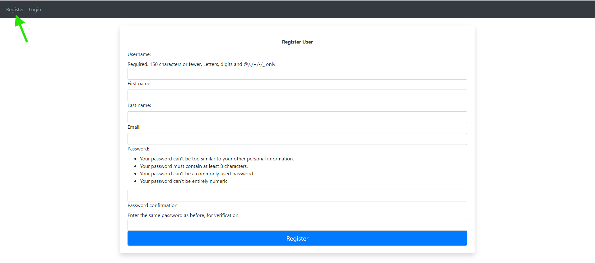

### Fill Out the Form

- **Username**: Enter a unique username that will be used for logging in.
- **Password**: Choose a strong password. You will need to confirm it by entering it again in the Confirm Password field.
- **First Name and Last Name**: Provide the user's full name.
- **Email**: Enter a valid email address. This will be used for notifications and recovery purposes.

### Submit the Form

- After filling out the registration form, click the Register button to submit your information.
- If the form is valid and all required fields are filled correctly, the system will create a new user account and log the user in automatically.
-If there are any issues with the form (e.g., passwords do not match, username already exists), appropriate error messages will be displayed.

### Post-Registration

- Once registered, the user is logged into the application. Initially, this user will have basic access rights with no additional permissions assigned.
- Permissions are managed separately and can be assigned or modified by a superuser from the manage_permissions page.

### Key Points
- **Default Permissions**: Newly registered users do not have specific permissions by default. Permissions must be assigned by an administrator based on the user's role and required access.
- **Security Measures**: Passwords are stored securely using hashing algorithms to ensure user data is protected.
- **Validation**: The form includes validation checks to ensure that all required fields are completed and that the password meets security standards.
- By following these steps, you can successfully register new users in the system and begin managing their access and permissions as needed.

# Login Screen:

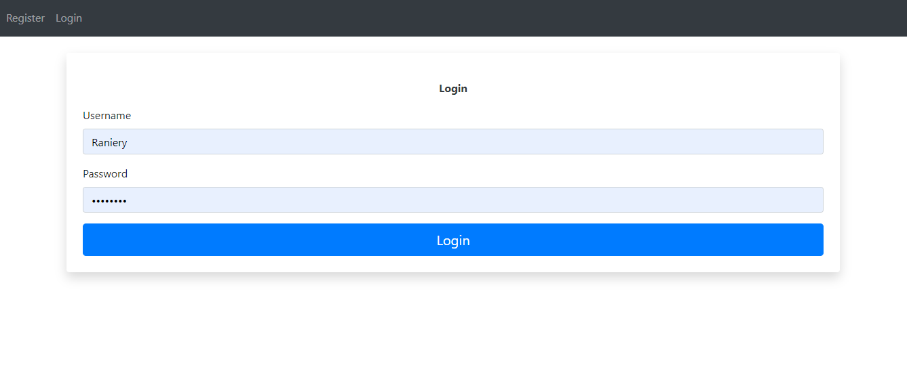

- ***Access the Login Screen***: 
    - Navigate to the login screen, where you'll be prompted to enter your credentials.
        - **Enter Credentials**:
            - **Username**:Enter the username you registered with.
            - **Password**: Enter the corresponding password for your username.
                - The system verifies your credentials against the registered users.

# Index Page:
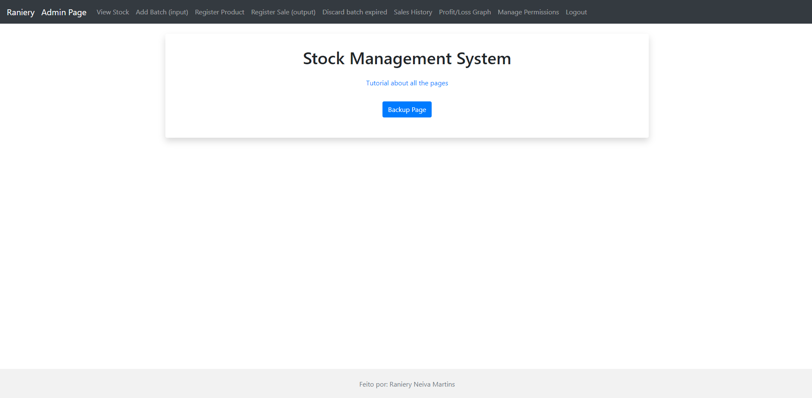

- ***Button Backup page***: Will be only visible to the Superuser for security reasons
    - Grant acess to the page where you can download the backup files and import back to the system.
    - Grant acess to export the data in XLSX file to use in Excel or Google Sheets using formulas and graphs

# Backup Page:
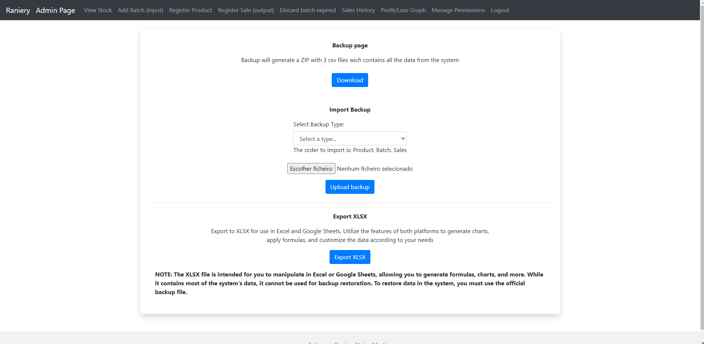
- ***Backup***
    - The Download button will generate a ZIP file with 3 files CSV, Products, Batch and Sales with all the datas from system

- ***Import***
    - Upload the File CSV to import to the System the data, the order is Product, Batch, Sales
        - Example: if the CSV contains 4 products, and the System already has 2 of the 4
            - The import will occur and report a message screen 2 import successfully, 2 itens already exists
    
- ***Export XLSX**
    - Download the data in a XLSX format to use with your formulas and graphs in Excel or Google Sheets..
        - Note: XLSX file may contain all the relevant data from the System, BUT it is not a backup file compatible to importing back in the system

# Stock View:

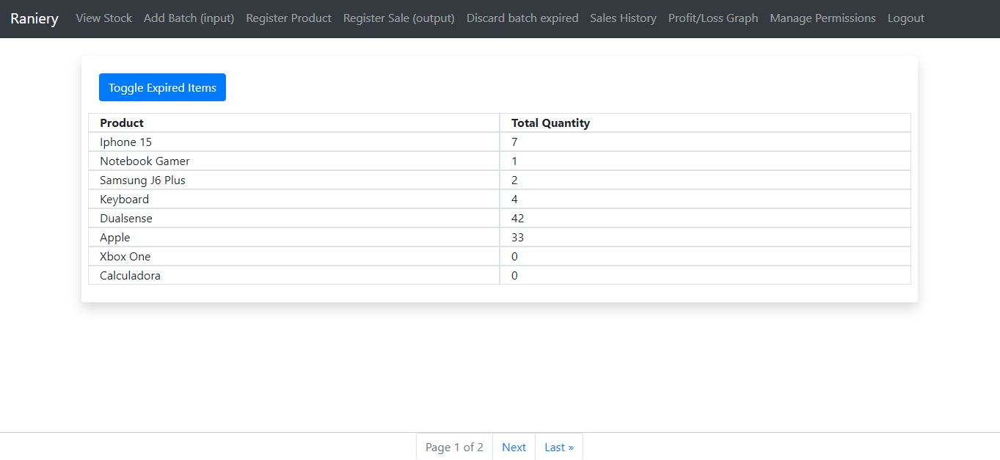
- The Stock View page is essential for viewing and managing products and their batches. This page uses a paginator to efficiently handle large volumes of data. Here’s how you can navigate and use the Stock View page.

- # How It Works
- The screen has a table with two collumns: Product and Total Quantity

- The main table lists the products along with the total quantity available.
    - Columns:
        - Product: The name of the product.
        - Total Quantity: The sum of all quantities available in different batches.
    
**Pagination**

- The page uses a paginator to manage the display of products.
The number of pages will depend on the number of products registered in the system.

**Viewing Batches**

- To view the batches of a product, click on the product name.
This will expand the row to show the available batches for the product, categorized as available or expired.
    - Note: Batches that have been completely sold out do not appear in the template to save resources.
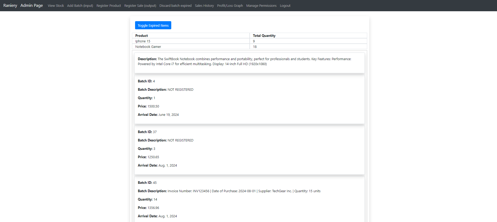

**Expired Batches**

- Expired batches are displayed in red, indicating that they are no longer available for sale.
These expired batches need to be discarded through the Discard functionality, marking them as "sold" at zero monetary value, which counts the loss in the graphs and sales records.
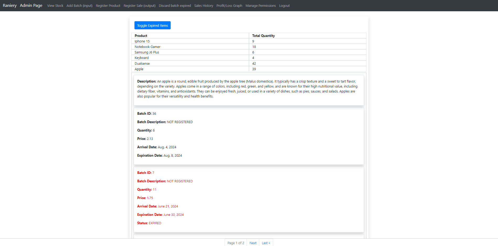

**Toggle Expired Items**

- A button located above the "Product" column allows you to toggle the visibility of expired products.
Clicking this button lets you hide or show expired products as per your preference.

**Product Description**

- When you click on the product name to view the batches, the product description is also displayed.
This provides a comprehensive view of the relevant information about the product.

**Key Points**
- Dynamic Data Handling: The paginator adapts to the number of products, ensuring that the page remains efficient and easy to use.
- Interactive Display: Clicking on a product to view its batches makes managing and understanding stock levels easier.
- Resource Optimization: Only batches with quantities greater than zero are sent to the template to save resources.

# Add Batch 
- The Register Batch page allows users to add new batches of products to the inventory. This process is essential for keeping track of stock levels and ensuring that all products are accounted for. Here’s how you can register a new batch:
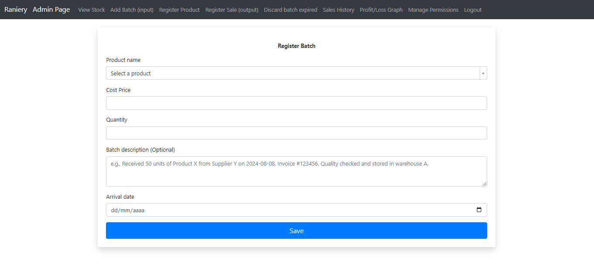

## How It Works

- **Select Product**

    - There is a dropdown select menu with all the products that have been previously registered in the system.
        - Select the product you want to create a new batch for.
        - **Cost Price**
            - Enter the cost price of the product for this batch.
            - This helps in tracking the cost of goods and calculating profit margins later.

        - **Quantity**
            - Input the quantity of the product in this batch.
            - This indicates how many units of the product are included in the batch.

        - **Batch Description (Optional)**
            - Provide additional details about the batch, such as invoice information or any relevant notes.
           -  This field is optional but can be useful for recording specific details about the purchase invoice or other batch-related information.

        - **Arrival Date**
            - Set the arrival date for the batch.
                - This is important for tracking the batch's lifecycle, especially for perishable items.
                    -  **Note**: It is allowed to set the arrival date to a past date to accommodate situations where registration might have been delayed. However, setting the arrival date to a future date is not allowed to ensure the accuracy and integrity of the inventory records.

**Key Points**
- **Dropdown Selection**: The product selection is made easy through a dropdown menu that lists all registered products.
- **Detailed Batch Information**: By specifying the cost price, quantity, and arrival date, each batch is thoroughly documented for accurate inventory management.
- **Tracking and Management**: The information provided during batch registration is crucial for tracking stock levels, calculating profits, and managing product lifecycles, particularly for perishable items.

# Register Product
- The Register Product page allows users to add new products to the system's inventory. This is a fundamental step for managing the stock and ensuring that all products are correctly entered into the system. Here’s how you can register a new product:
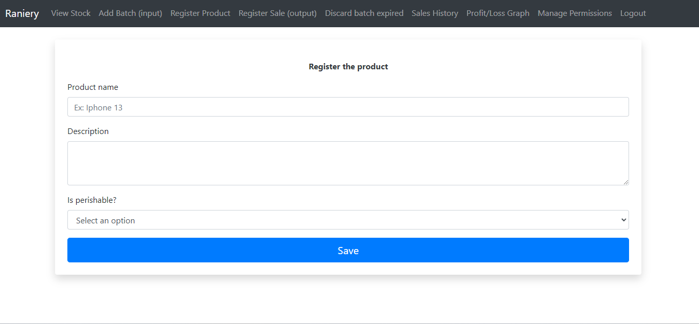
## How It Works

- **Product Name**

    - Enter the name of the product.
        - This name will be used to identify the product throughout the system, so it should be clear and descriptive.
        - If the product has different models or variations (e.g., different storage capacities), include these details in the product name to differentiate them. For example:
            - Iphone 15 128GB
            - Iphone 15 1TB
        - This ensures that each variation is uniquely identifiable within the system, avoiding confusion and helping with accurate stock management.

- **Description**
    - Provide a detailed description of the product.
        - This can include information about the product's features, uses, and any other relevant details that may help in understanding the product better.
        - Highlight any specific details related to the product variation, such as different storage capacities, color options, or any other distinguishing features.

- **Is Perishable**
    - Indicate whether the product is perishable or non-perishable.
        - This is an important field as it helps in managing the lifecycle of the product, especially for inventory tracking and expiry management.

- **Perishable**: Products that have a limited shelf life and need to be sold or discarded before they expire.
- **Non-Perishable**: Products that do not have a strict expiration date and can be stored for longer periods.

# Edit Product Description

To edit the description of a product, follow these steps:

- Access the Django Administration

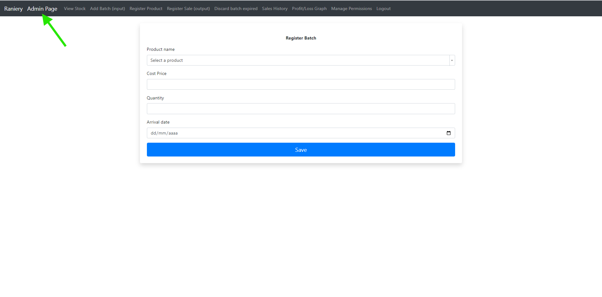

- First, navigate to the Django Admin interface. Typically, you can access this by adding /admin to the end of your site's URL or Clicking on the link located on the upper left.
- Log in with your admin credentials.

- Click on Products

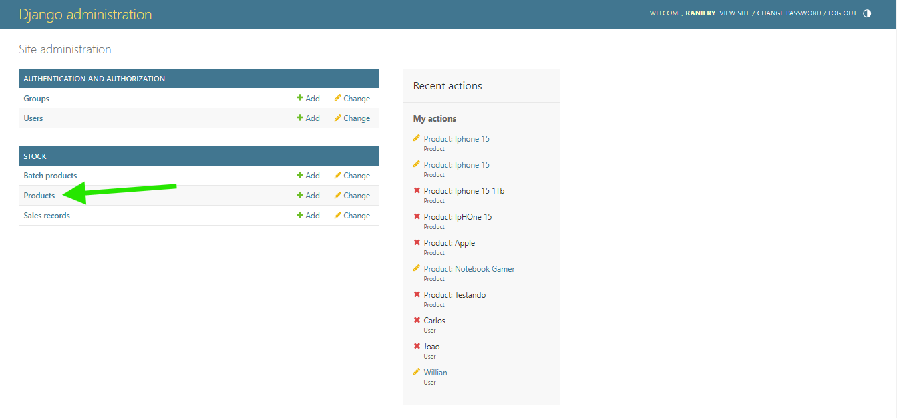

- In the list of products, find the product whose description you want to edit.
    - Select the Product: Click on the product name to open the edit page for that product.

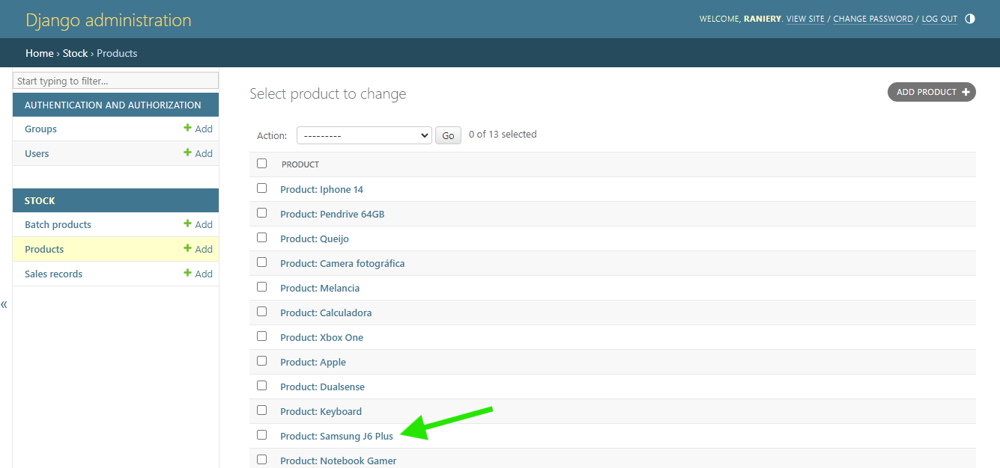

- Edit the Description

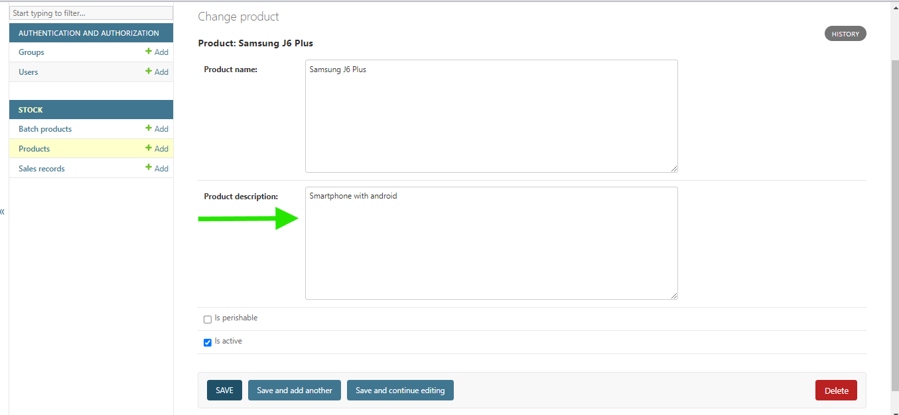

- After editing the description, scroll to the bottom of the page and click the Save button to save your changes.

# Important Information About Inactive Products
- **Inactive Products**

    - When a product is set to inactive, it will not appear in the selection list for adding new batches.
        - This ensures that you won't accidentally add new stock for products that are no longer active in your inventory.

    - However, inactive products will still appear in the sales history and profit/loss graph.
    - This is important for maintaining accurate historical records and financial reporting.
    - By displaying inactive products in these views, you can ensure that all past sales data and profitability calculations remain complete and accurate, providing a comprehensive view of your business performance.

# How to Activate or Deactivate a Product
To Activate or Desactivate a product, follow the same steps you use to edit the product description:

- Click on Is Active option and save.
    - When the Is Active is marked on, is TRUE
    - When the Is Active is marked off, is FALSE

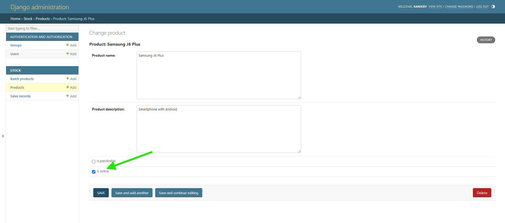

# Register Sale
- The Register Sale page is designed to facilitate the recording of sales transactions within the system. Here's a detailed breakdown of how to use this feature:
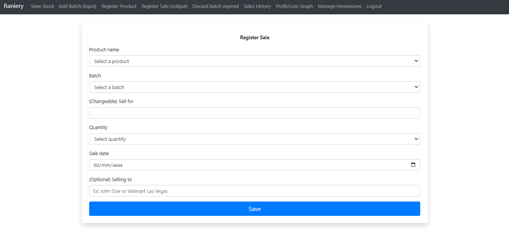

## How It Works
-  **Product Dropdown**
    - Select the product being sold from a dropdown menu.
        -  This menu lists all products previously registered in the system

- **Batch Dropdown**

    - After selecting a product, choose the specific batch from a dropdown menu.
        - This dropdown only shows batches related to the selected product and excludes expired or sold-out batches.

- **Sell For**
    - This field is automatically filled with the cost price from the batch.
    - The value is editable, allowing you to set the actual selling price.
        - Selling at the default cost price results in no profit, as it is the acquisition cost.
        - Selling below the cost price will be recorded as a loss.
        - Selling above the cost price will be recorded as a profit.

- **Quantity**
    - Select the quantity being sold.
        - The dropdown only shows the available quantity in the selected batch. For example, if the batch has 7 units, you can select any quantity from 1 to 7.

- **Sale Date**

    - Choose the sale date.
        - The date range available starts from the batch's arrival date up to the current date. For example, if the batch arrived on July 14, 2024, and today is July 25, 2024, you can select any date between July 14 and July 25.
        - This allows for backdating sales entries that were not recorded on time.
        - Sales dates before the batch arrival or in the future are not permitted.

- **Selling To (Optional)**

    - This field is optional and can be used to record the name of the customer to whom the product was sold.
    - It is useful for maintaining records of customer transactions if needed.

**Key Points**

- **Batch and Product Correlation**: The system ensures only relevant and available batches for the selected product are shown, enhancing accuracy and efficiency.

- **Dynamic Pricing**: The ability to modify the selling price allows flexibility in pricing strategies and accurate profit/loss calculations.

- **Controlled Quantity Selection**: Limiting the quantity selection to the available stock in the batch prevents overselling and ensures data integrity.

- **Flexible Date Selection**: The sale date selection mechanism accounts for late entries while ensuring logical consistency by preventing future or pre-arrival date entries.

- **Optional Customer Tracking**: The optional "Selling To" field adds an extra layer of transaction detail, useful for customer management.
- By following these steps, users can accurately and efficiently register sales transactions, ensuring that inventory levels are updated and financial records reflect actual sales activities.

# Discard Batch
- The Discard Batch page is designed to record the disposal of expired items, ensuring accurate inventory tracking and financial reporting. Here's a detailed breakdown of how to use this feature:
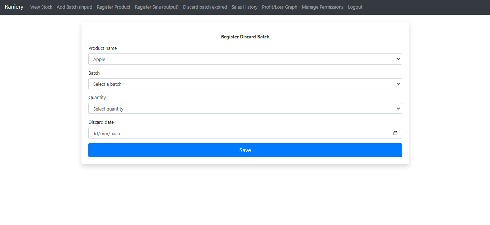

### Purpose ###

- This page is used to register the disposal of expired batches.
    - For example, if Batch ID 45 of apples expired on July 26, it is automatically marked as expired and cannot be sold, but it is not automatically discarded. The user must register the disposal date.

## How It Works

- **Product Dropdown**
    - Select the product from a dropdown menu, which lists only perishable items.

- **Batch Dropdown**
    - After selecting a product, choose the specific batch from a dropdown menu.
        - This dropdown shows only expired batches related to the selected product.

- **Quantity**
    - Select the quantity being discarded.
        -  The dropdown shows the available expired quantity in the batch. For example, if the batch has 50 expired units, you can select any quantity from 1 to 50.
            - If, for some reason, only a portion of the expired items can be discarded today, you can specify the exact number being discarded (e.g., discard 25 units out of 50).

- **Discard Date**
    - Choose the discard date.
        - The date range available starts from the batch's expiration date up to the current date. For example, if the batch expired on July 4, 2024, and today is July 28, 2024, you can select any date between July 4 and July 28.
            - This allows for backdating discard entries that were not recorded on time while ensuring logical consistency by preventing future or pre-expiration date entries.

- **Automatic Loss Recording**
    - When a batch is discarded, it is recorded as a sale with a price of 0, indicating no profit was made.
    - The "Selling To" field is automatically set to "Sold to: No one (EXPIRED)" to indicate that the items were discarded.

**Key Points**
- Controlled Product and Batch Selection: The system ensures only relevant and expired batches for the selected perishable product are shown, enhancing accuracy and efficiency.

- Flexible Quantity Selection: Limiting the quantity selection to the available expired stock in the batch prevents discrepancies and ensures data integrity.

- Accurate Discard Date Selection: The discard date selection mechanism accounts for late entries while ensuring logical consistency by preventing future or pre-expiration date entries.

- Automatic Financial Reporting: Discarded items are recorded as sales with zero revenue, accurately reflecting losses in the financial reports.

- Customer Field Automation: The "Selling To" field is automatically updated to indicate that the items were discarded, ensuring clarity in transaction records.

- By following these steps, users can accurately and efficiently register the disposal of expired items, ensuring that inventory levels and financial records reflect actual stock activities and losses.

# Sales History
- The Sales History page provides a comprehensive view of all sales transactions within the system. Here's a detailed guide on how it works and the features it offers:

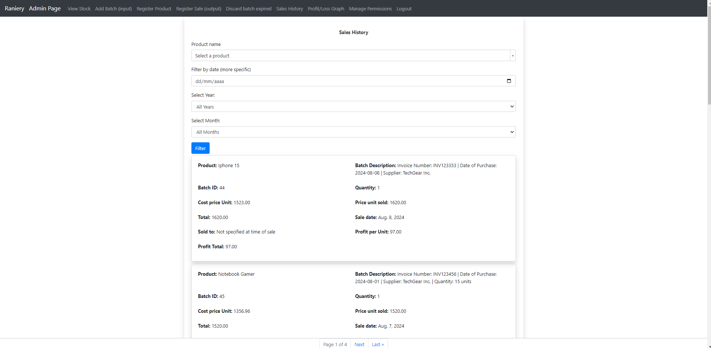

**Initial Display**

- The page initially shows all sales records, utilizing a paginator to manage the display efficiently.
This ensures the page remains responsive, regardless of the volume of sales data.

## How It Works

- **Filtering Options**
    - To refine your search, the page offers multiple filtering options:
        - Product Select: Choose a specific product from a dropdown list to see all sales related to that product.
        - Filter by Date: Perform a specific date search. For instance, find sales of "iPhone 14" on "01/01/2024".
        - Year Select: Only displays years with recorded sales. For example, if there are sales records for the years 2020, 2022, and 2024, these years will be available in the dropdown, along with an "All Years" option. This filter shows all sales within the selected year.
        - Month Select: Filter sales by month. For example, select "July" to see all sales in July across all recorded years, or combine it with a specific year (e.g., 2020 + July) for a more precise search.

- **Sales Data Display**

    - The sales history table displays the following details for each sale:
    - Product Name: The name of the sold product.
    - Batch Description: The details about invoice.
    - Batch ID: The batch identifier from which the product was sold.
    - Quantity: The number of units sold.
    - Cost Price: The acquisition cost per unit.
    - Price Sold: The sale price per unit.
    - Total: The total revenue from the sale (Quantity x Price Sold).
    - Sale Date: The date the sale was made.
    - Sold To: The customer or entity to whom the product was sold if specified.
    - Profit Total: The total profit from the sale (Total Revenue - Total Cost).
    - Profit Per Unit: The profit made on each unit sold (Price Sold - Cost Price).

**Key Points**

- Comprehensive Filtering: The filtering options provide flexibility to narrow down sales records based on product, specific dates, months, and years, making it easier to find relevant sales data.
- Dynamic Display: The paginator keeps the page dynamic and responsive, handling large volumes of data without performance issues.
- Detailed Sales Information: Each sale record includes detailed financial information, helping users to analyze profit margins and sales performance.
- User-Friendly Interface: The intuitive design ensures that users can quickly find and review sales records, supporting better decision-making and inventory management.
- By leveraging these features, users can efficiently track and analyze sales data, ensuring accurate reporting and insightful analysis of the stock management system.

# Profit/Loss Graph
- The Profit/Loss Graph page provides a visual representation of the sales performance, displaying profits and losses over time. This page utilizes Plotly for creating interactive and dynamic graphs. Here's a detailed guide on how it works and the features it offers:
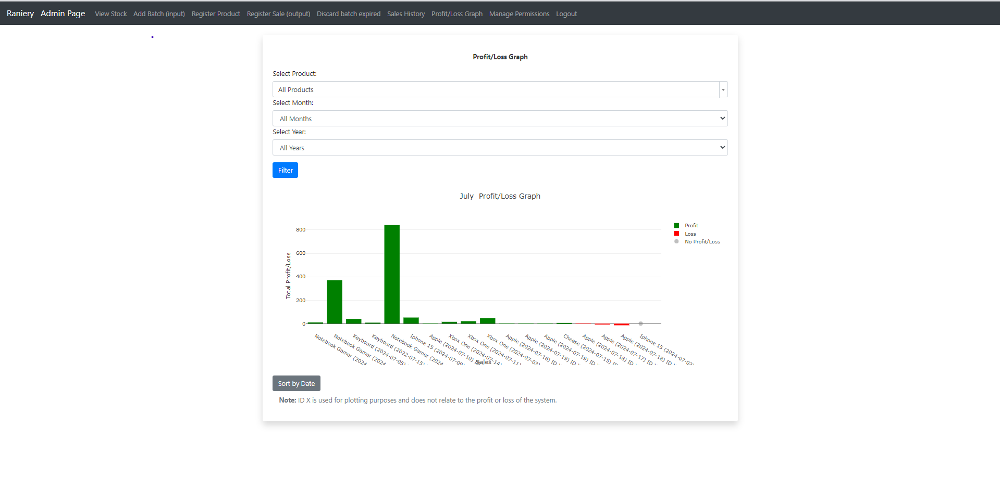

**Graph Overview**

- The graph displays all sales records, showing profits in green, losses in red and grey dots to *No Loss/Profit* (when is the product is sell to the cost price).
It provides an intuitive and visual way to analyze the financial performance of the sales over time.

## How It Works

**Filtering Options**

- **The page offers three dropdown filters to refine the displayed data**:
    - **Select Product**: Choose a specific product or select "All Products" to see aggregated data for all products.
    - **Select Month**: Filter the data by a specific month or select "All Months" to view data across all months.
    - **Select Year**: Similar to the Sales History page, only years with recorded sales are displayed in the dropdown. This allows users to filter data for a specific year or select "All Years" to view data across all recorded years.

- **These filters can be combined to narrow down the data**:
    - Filter by month alone, year alone, or both month and year together.
    - Filter by product, month, and year together for a more specific analysis.

**Interactive Graph Features**

- **Legend Interaction**: Clicking on the legend items (Profit or Loss) will toggle the visibility of the respective data on the graph. This helps in focusing on either profits or losses as needed.
- **Export as PNG**: The graph can be saved as a PNG file by clicking on the camera icon in the top right corner of the graph. This feature allows users to export and share the visual data easily.

- **Visual Indicators for Cost Price Sales**

    - Products that were sold at their cost price are represented by gray dots on the graph. Since these sales have no profit or loss, they do not have corresponding bars. The gray dots help in identifying these neutral sales.

**Note on ID X**
 - The graph uses "ID X" for plotting purposes, which helps in organizing the data on the graph. This ID does not relate to the actual profit or loss of the system but is purely for plotting convenience.

**Key Points**
- **Comprehensive Filtering**: The dropdown filters provide flexibility to narrow down the data based on product, month, and year, making it easier to analyze specific periods and product performance.
- **Interactive and Dynamic**: The use of Plotly allows for interactive elements such as toggling data visibility and exporting graphs, enhancing the user experience.
- **Visual Analysis**: The color-coded profit (green) and loss (red) bars provide an immediate visual indication of the financial performance, helping users quickly identify trends and outliers.
- **Neutral Sales Representation**: Gray dots represent sales at cost price, offering a clear visual distinction for neutral sales.
- **Export Capability**: The ability to save the graph as a PNG file supports easy sharing and reporting of the data.
- By leveraging these features, users can efficiently track and analyze the financial performance of their sales, ensuring accurate reporting and insightful analysis.

# Manage Permissions
- The Manage Permissions feature is an essential part of the system, providing the ability to control user access and actions within the application. This functionality is accessible only to the superuser, ensuring that only authorized personnel can modify permissions. Here’s a detailed guide on how it works:

**Superuser Access Only**

This page is restricted to the superuser of the system. Regular users do not have access to this functionality.
**User Selection**

- A dropdown menu lists all registered users in the system.
- Initially, users do not have any permissions assigned.

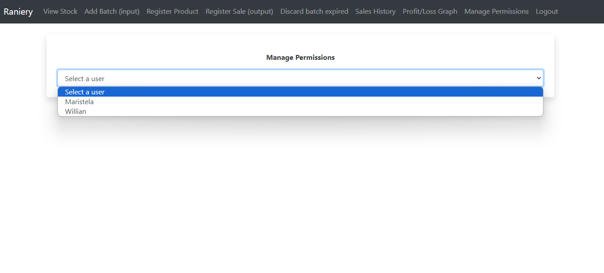

**Accessing Manage Permissions**

- **Current and Available Permissions**

- After selecting a user, two lists are displayed:
    - Current Permissions: The permissions that the selected user currently has.
    - Available Permissions: Permissions that can be assigned to the user.

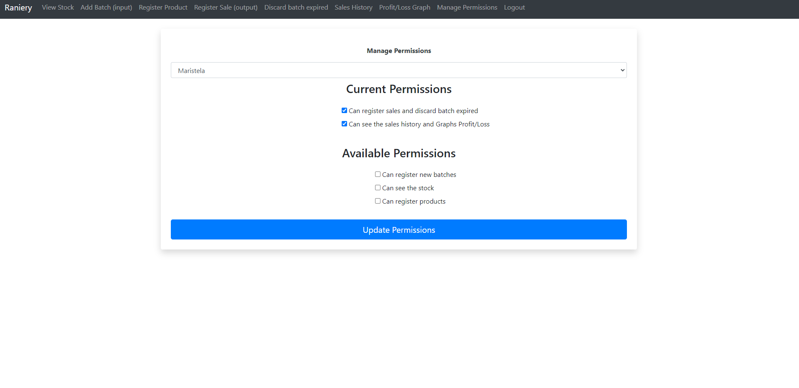

## Managing Permissions ##

- **Assigning Permissions**

    - To assign new permissions, simply check the desired permissions from the available permissions list.
        - Click the Update Permissions button to apply the changes.

- **Removing Permissions**
    - To remove existing permissions, uncheck the permissions from the current permissions list.
        - Click the Update Permissions button to apply the changes.

## Permission Descriptions ##

**Can Register Sales and Discard Batch Expired**
   - Grants access to register sales and discard expired batches. Discarding a batch is treated as a sale with a value of zero, thus it is included in the sales functionality.

**Can See the Sales History and Graphs Profit Loss**

   - Grants access to view the Sales History and Profit/Loss Graph pages. Since the graph is a visual representation of the sales history data, this permission combines access to both functionalities.

**Can Register New Batches**

   - Allows the user to register the arrival of new batches, including setting the cost price, quantity, and arrival date.

**Can See Stock**
   - Provides access to view the stock page, where users can see the list of products and their respective batches, including details like quantity and expiration status.

**Can Register Products**

   - Enables the user to register new products in the system, including setting the product name, description, and whether it is perishable.

**Permission Updates**

- The system ensures that permission changes are instantly reflected, enabling or disabling user access to specific functionalities based on the permissions granted.
- By implementing this detailed and user-friendly permission management system, the application ensures that only authorized users can perform certain actions, enhancing security and control within the system.

**Key Points**
- Simplicity and Clarity
- User-Friendly Interface

- The interface is designed to be straightforward and self-explanatory. Users can easily understand which permissions are required for different actions.

